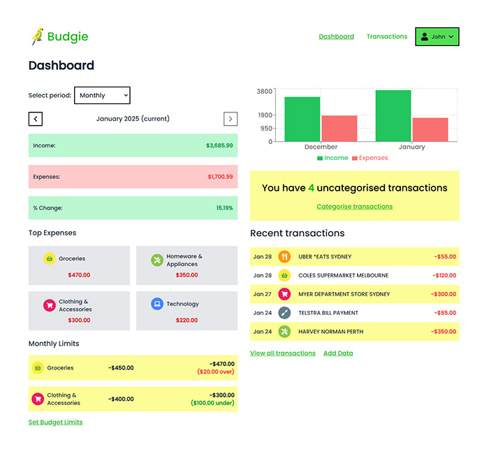

# Budgie

An app aimed at simplifying budgeting

## Overview

Budgie is a personal budgeting tool designed to help individuals easily track their spending, manage income, and stay on top of their finances. It simplifies the process of organizing transactions and provides clear insights into financial habits, empowering users to make better financial decisions.

## Technologies

- **Backend**: .NET Core API
- **Database**: PostgreSQL
- **Frontend**: React
- **Styling**: TailwindCSS
- **Authentication**: JWT Authentication
- **Hosting**: Linux VPS with nginx

## Features

- Track and manage personal income and expenses
- Categorize transactions for better financial organization
- View insights and trends on spending habits
- Easy-to-use interface for budgeting and financial planning
- Secure authentication using JWT

## Demo

You can check out a live demo of the application here:

[Live Demo](https://liamensbey.com/budgie/)

## Installation

### Prerequisites

- .NET Core 8 SDK (version 8 or higher)
- Node.js (version 16 or higher)
- PostgreSQL

### To run in the app in development mode:

1. Clone this repository:

   ```bash
   git clone https://github.com/liam-e/budgie
   cd budgie
   ```

2. Set up the backend (API):

   - Restore dependencies:
     ```bash
     dotnet restore
     ```
   - Set up the database in PostgreSQL and update the connection string in `appsettings.Development.json`.
   - Run the backend API on http://localhost:5000:
     ```bash
     ./run.sh
     ```

3. Set up the frontend (React app):

   - Navigate to the frontend folder:
     ```bash
     cd Client/
     ```
   - Install dependencies:
     ```bash
     npm install
     ```
   - Start the frontend:
     ```bash
     npm run dev
     ```

4. The application should now be running locally at [http://localhost:3000/budgie/](http://localhost:3000/budgie/).

## Development

### Backend

The backend is built using .NET Core API, and it is responsible for handling transactions, user authentication, and interacting with the database. You can find the backend code in the `Budgie.API` folder.

### Frontend

The frontend is built with React and TailwindCSS for styling. It handles the user interface and communicates with the backend to fetch and display financial data. You can find the frontend code in the `Client` folder.

## Links

- [Live Demo](https://liamensbey.com/budgie/)
- [Source Code](https://github.com/liam-e/budgie)


